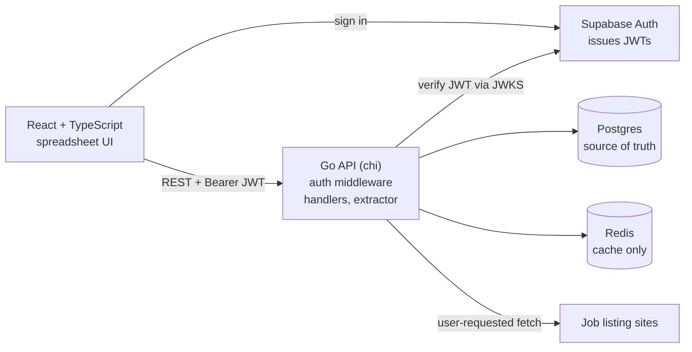
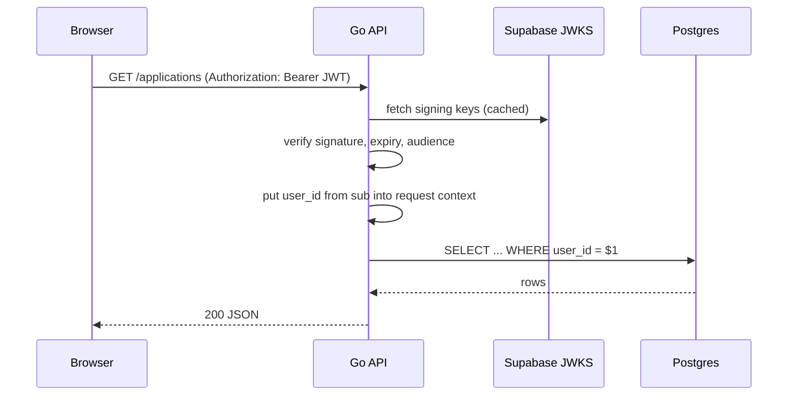
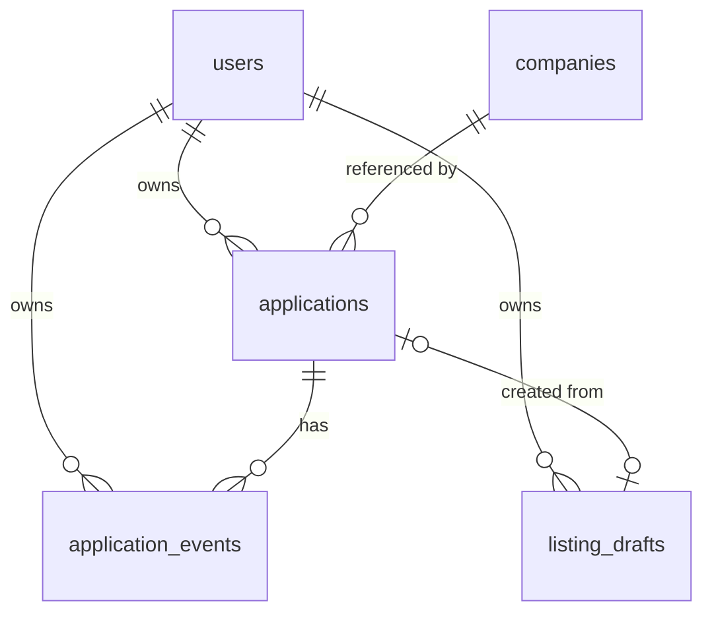

# Architecture: Internship Tracker

## System Overview



## Components

| Component | Runs where | Responsibility |
|-----------|-----------|----------------|
| React frontend | Browser | UI, bucket tabs, inline edits, holds Supabase session |
| Supabase Auth | Hosted by Supabase | Sign up, sign in, issues JWTs |
| Go API | Container | Verifies JWTs, validates input, business rules, scoped queries |
| Extractor | Inside the Go API | Fetches a listing URL, parses fields into a draft |
| Postgres | Container locally, hosted in prod | All persistent data |
| Redis | Container locally, hosted in prod | Extraction cache and analytics cache. Never the source of truth |

The extractor lives inside the API process for v1. It becomes a separate worker
only if slow fetches start blocking requests.

## Trust Boundaries

- The browser is untrusted. Every rule is enforced in the Go API, not the UI.
- The user id comes only from the verified JWT `sub` claim, never from a request
  body, query param, or header the client controls.
- Every query on user-owned data includes `WHERE user_id = $current_user`.
- Requests for another user's row return 404, not 403, so the API never confirms
  that the row exists.
- Redis keys for user data always include the user id.
- The frontend only ever holds the Supabase anon key. The service role key is
  never used by this app.

## Request Flow: Authenticated Request



## First Ten Endpoints

| # | Method | Path | Purpose |
|---|--------|------|---------|
| 1 | GET | /health | Liveness check, no auth |
| 2 | GET | /applications | List the user's applications with filters and sorting |
| 3 | POST | /applications | Create a manual application |
| 4 | PATCH | /applications/{id} | Edit fields other than status |
| 5 | DELETE | /applications/{id} | Hard delete, only allowed while status is saved |
| 6 | POST | /applications/{id}/status | Change status and write an event |
| 7 | POST | /listing-drafts | Fetch a URL and create an extracted draft |
| 8 | GET | /listing-drafts/{id} | Read a draft for review |
| 9 | PATCH | /listing-drafts/{id} | Edit extracted fields |
| 10 | POST | /listing-drafts/{id}/accept | Create an application from a reviewed draft |

Later: `GET /applications/{id}/events` and `GET /analytics/summary`.

### API Rules

- `PATCH /applications/{id}` cannot change status. Status only changes through
  the status endpoint, so every change writes an event.
- `DELETE` on an application past saved returns 409 `cannot_delete_submitted`.
- Accepting a draft whose URL already exists as one of the user's applications
  returns 409 `duplicate_application`.

### Error Shape

```json
{"error": {"code": "validation_error", "message": "deadline must be YYYY-MM-DD"}}
```

| Status | Code examples |
|--------|---------------|
| 400 | validation_error, invalid_status_transition |
| 401 | unauthorized |
| 404 | not_found |
| 409 | cannot_delete_submitted, duplicate_application, draft_already_accepted |
| 422 | extraction_failed |
| 502 | upstream_fetch_failed |

## First Five Tables



### users
- `id` UUID primary key, equal to the Supabase auth user id (`sub`)
- `email`, `created_at`
- Row is created on the user's first authenticated request

### companies (global, not user-owned)
- `id` UUID primary key
- `name`, `normalized_name` (lowercase, trimmed, unique), `domain` nullable
- Shared across users so the same company is one row
- No endpoint lists all companies, because that would reveal where other
  users applied

### applications
- `id` UUID, `user_id` FK, `company_id` FK
- `title`, `category` enum (swe, data, pm, hardware, other), `category_label` nullable text
- `locations` text array
- `salary_min`, `salary_max` numeric nullable, `salary_currency` char(3),
  `salary_period` enum (hour, month, year, unknown)
- `deadline` DATE nullable
- `status` enum (saved, applied, oa, interview, offer, rejected, archived)
- `source_url` nullable, `source_url_hash` nullable
- `notes` text, `created_at`, `updated_at`
- Indexes: (user_id, status), (user_id, deadline), (user_id, updated_at)
- Unique: (user_id, source_url_hash) where source_url_hash is not null

### listing_drafts
- `id` UUID, `user_id` FK
- `source_url`, `normalized_url_hash`
- Extracted fields matching applications, all nullable
- `state` enum (pending, accepted, failed)
- `error_code` nullable, `extraction_method` (json_ld, opengraph, heuristic)
- `field_confidence` JSONB
- `application_id` FK nullable, set on accept
- `created_at`, `updated_at`
- Index: (user_id, normalized_url_hash)

### application_events
- `id` UUID, `application_id` FK, `user_id` FK (duplicated for scoped queries)
- `type` enum (created, status_changed, deadline_changed, note_added, draft_accepted)
- `from_status`, `to_status` nullable
- `payload` JSONB, `created_at`
- Indexes: (application_id, created_at), (user_id, created_at)
- Events are append-only. Analytics and un-archiving both depend on them.

## Local Development Topology

| Service | Host access | Notes |
|---------|-------------|-------|
| Go API | localhost:8080 | Run with go run until Phase 4 |
| Vite | localhost:5173 | npm run dev |
| Postgres | 127.0.0.1:5432 | Docker Compose |
| Redis | 127.0.0.1:6379 | Docker Compose, no auth, localhost only |
